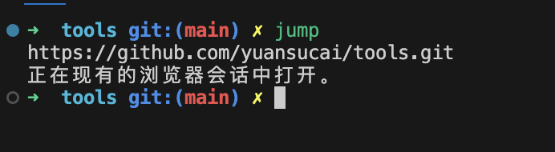

# zsh-jump-git

### 安装
1. 首先将文件克隆到 .oh-my-zsh 文件夹下
```bash
git clone https://github.com/yuansucai/zsh-jump-git.git ${ZSH_CUSTOM:-~/.oh-my-zsh/custom}/plugins/zsh-jump-git
```
2. 修改 .zshrc
命令行输入
```bash
code ~/.zshrc
```
在.zshrc文件中加入一行
```bash
source $ZSH/custom/plugins/zsh-jump-git/jump-git.zsh
```
保存，最后再应用一下 .zshrc 配置文件
```bash
source ~/.zshrc
```

### 使用

只要在命令行输入 **jump**，就能快速打开当前项目对应的远程仓库(如果不在一个git仓库下，则会提示不是git仓库)


